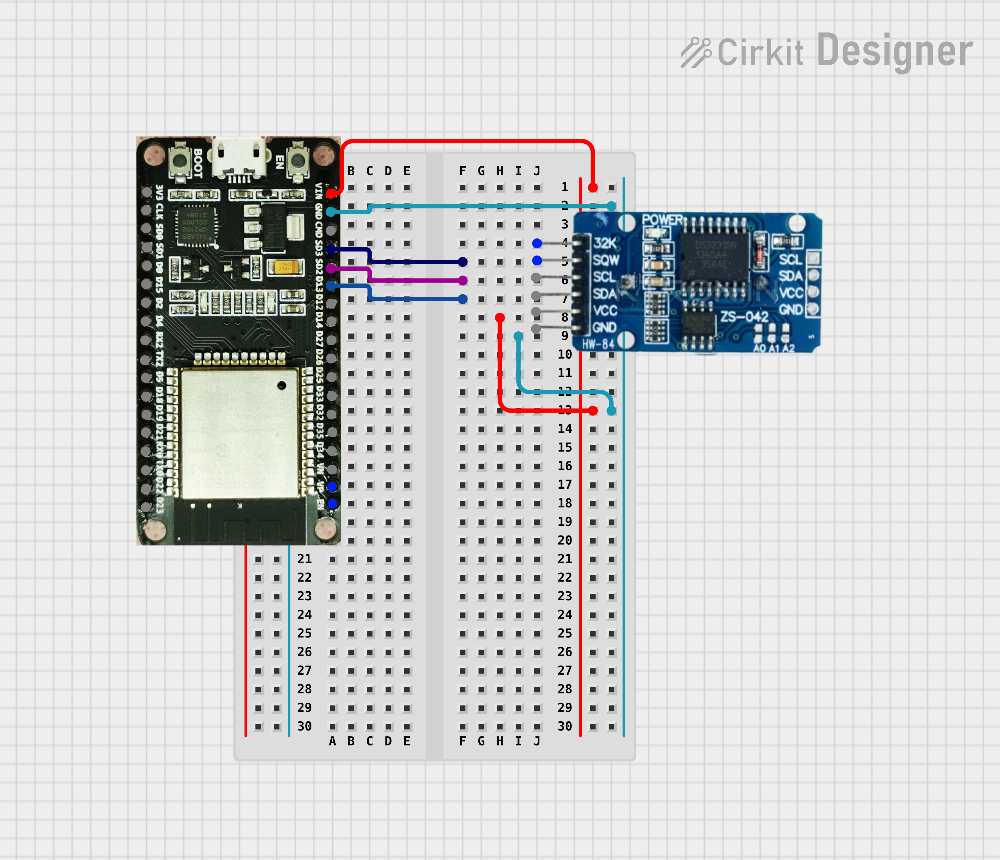

# esp-idf-ds3231

An esp-idf component for the Analog Devices (Maxim Integrated) DS3231
RTC chip/module.

esp-idf-ds3231 is a component for the esp-idf. The component abstracts
all the features in to get/set functions. The component is 100% feature
complete. All time keeping, alarm and control function are part of the
comoment, including alarm interrupt functionality.

This my first fully documented and shared open source project. I welcome
comments, suggestions and corrections.

The areas I could use help in are the documentation generation and
configurion on readthedics.io.

<figure>

<figcaption>Cirkit Designwe image of an ESP32 connect to a DS3231
module.</figcaption>
</figure>

## Getting Started

In and ESP-IDF terminal run:
`idf.py add-dependency "jschwefel/esp-idf-ds3231^1.0.0"` \###
Prerequisites

The things you need before installing the software.

-   esp-idf v5.0+

## Usage

The code used in the example program:
```C
    #include <stdio.h>
    #include "esp-idf-ds3231.h"

    void app_main(void) {
       // Allocte memory for the pointer of i2c_master_bus_handle_t
       i2c_master_bus_handle_t* bus_handle = 
            (i2c_master_bus_handle_t*)malloc(sizeof(i2c_master_bus_handle_t));
       // Create the i2c_master_bus_config_t struct and assign values.
       i2c_master_bus_config_t i2c_mst_config = {
          .clk_source = I2C_CLK_SRC_DEFAULT,
          .i2c_port = -1,
          .scl_io_num = GPIO_NUM_5,
          .sda_io_num = GPIO_NUM_4,
          .glitch_ignore_cnt = 7,
          // The DS3231 **requires** pullup resistors on all of its I/O pins. 
          // Note: Some DS3231 boards have pullup resistors as part
          // of their design.
          .flags.enable_internal_pullup = true,
       };
       i2c_new_master_bus(&i2c_mst_config, bus_handle);
       rtc_handle_t* rtc_handle = ds3231_init(bus_handle);

       time_t now;
       char strftime_buf[64];
       struct tm timeinfo;
       now = ds3231_time_unix_get(rtc_handle);
       localtime_r(&now, &timeinfo);
       strftime(strftime_buf, sizeof(strftime_buf), "%c", &timeinfo);
       printf("The current time from the DS3231 RTC moldue is: %s\n", strftime_buf);
    }
```