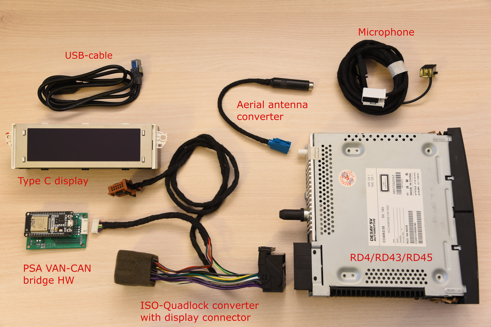
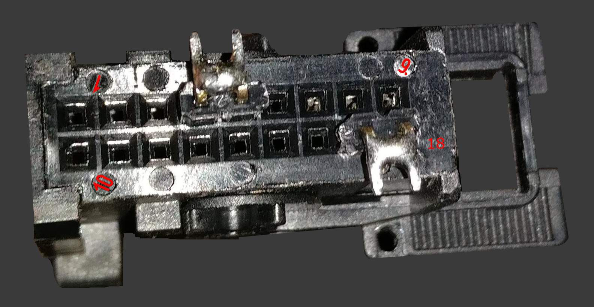
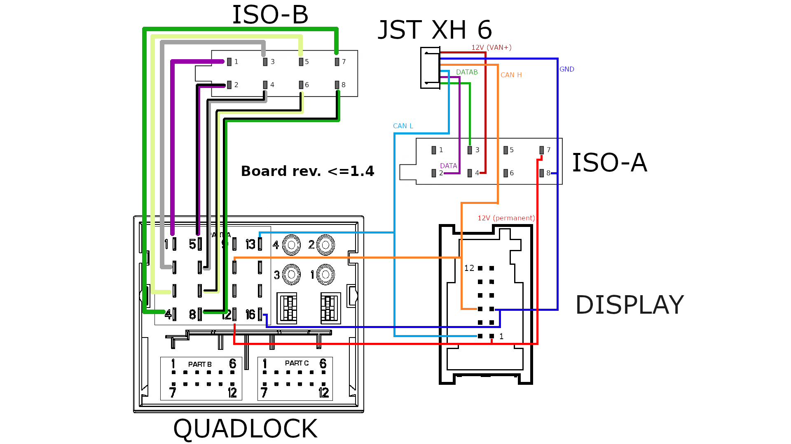
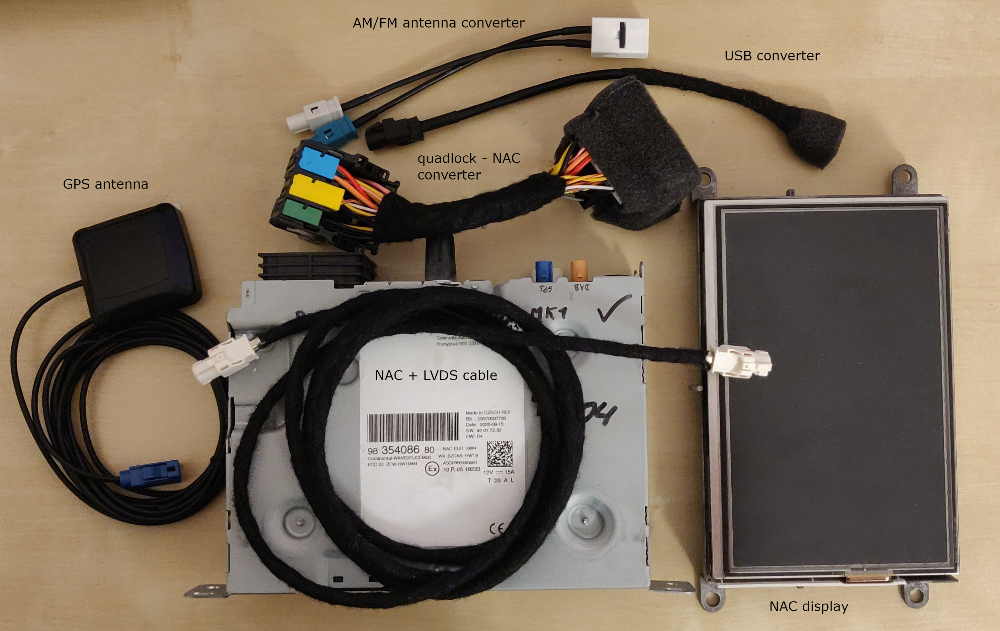
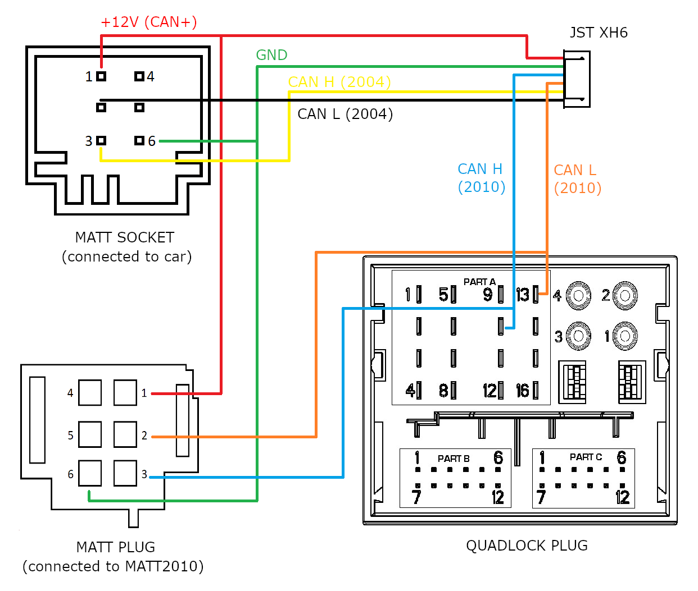
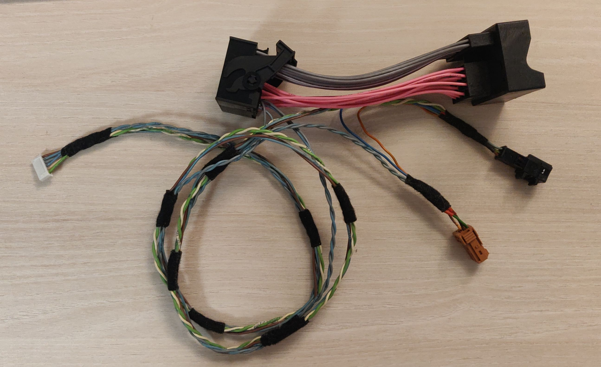

# PSA VAN-CAN protocol bridge

## What is it ?

In the early 2000s, the PSA Group (Peugeot and Citroën) used a VAN+CAN architecture in their cars. This protocol, also known as AEE2001, used the VAN bus to communicate with various comfort-related equipment and the CAN bus for communication between the BSI and the engine ECU. Around 2005, PSA transitioned to a full CAN (or CAN+CAN) architecture. The CAN+CAN system underwent several evolutions—AEE2004, AEE2007, and later AEE2010—none of which are backward compatible. This means, for example, that a head unit from a newer architecture will not work in a car with an older one. Actually AEE2004 and AEE2007 are mostly compatible and when I refer to AEE2004 below it applies to AEE2007 as well.

The goal of this project is to enable newer peripherals—mainly head units (RD4, RD43, RD45), telematics units (RT6, RCC, NAC, etc.), and multifunction displays (EMF-C, matrix display - MATT)—to function in cars using older protocols.

This is the third iteration of the software and it supports the following conversions (with compatible hardware):
  - AEE2001 ⇒ AEE2004 (VAN-CAN conversion)
  - AEE2001 ⇒ AEE2010 (VAN-CAN conversion)
  - AEE2004 ⇒ AEE2010 (CAN-CAN conversion)

In essence, this software merges the functionality of my previous two projects: PSA VAN-CAN bridge and [PSA CAN bridge](https://github.com/morcibacsi/PSACANBridge).

## Why ?

Because it's fun! But seriously, I wanted to replace the head unit in my car with one that supports MP3 playback while retaining functionality of the original steering wheel remote stalk. I also wanted a shiny new display from newer models to work in my car. If you're interested, you can read the full development story in the [History section in the wiki](wiki/history.md).

## Versions

As mentioned before, this is the third iteration of the software. The previous versions are still available in separate branches, but they will no longer receive updates. The versions may differ in features, and not all features will necessarily be carried over to the latest version. However, feel free to open an issue if there's something you'd like to see supported—I might reconsider it upon request.

- [v1 - former master branch](https://github.com/morcibacsi/PSAVanCanBridge/tree/v1)
- [v2 - former main branch](https://github.com/morcibacsi/PSAVanCanBridge/tree/v2)
- [v3](https://github.com/morcibacsi/PSAVanCanBridge/tree/v3)

## Liability

I've used the software in my own car for years without any issues. However, I take no responsibility if something goes wrong when you build and install it in your own vehicle. Use both the software and hardware at your own risk.

## Warning

⚠️ There is a known issue with certain vehicles where the board can cause the BSI to crash. Please read the details and the workaround here: [#34](https://github.com/morcibacsi/PSAVanCanBridge/issues/34)

## PCB

You need a custom PCB for the software. I built several hardware revisions using various ESP32 microcontrollers, integrating CAN transceivers and the TSS463C VAN controller onto one board. The KiCad project files are available in [this repository][psavancanbridgehw].

## VAN-CAN (AEE2001 ⇒ AEE2004)
### Components

To make the project work in your car, you'll need:
- Head unit (RD4/RD43/RD45)
- Multifunction display
- ISO-Quadlock-Display-JST XH6 conversion cable ([see more info in the wiki](wiki/pinouts-and-patch-lead.md))
- ISO-fakra aerial antenna converter
- PSA VAN-CAN protocol bridge hardware



### Functionality

I implemented features found in the original V2C boards (see the [history section in the wiki](wiki/history.md))—and more! Here's a video demonstrating most of the functionality. Click on the image to start playing the video.

[](https://www.youtube.com/watch?v=Qk_8EhsqwUA "Watch it on YouTube")

List of supported functions:

 - Head unit support: RD4/RD43/RD45/RT6/NAC
 - Radio remote stalk support
 - VIN bridging for the anti-theft functionality of the RD4/RD43/RD45 head units
 - Speed and RPM data for automatic volume correction
 - Multifunction display (MFD) messages
 - Air conditioning status: fan speed, recirculation, rear demist, A/C on, temperature, airflow direction (via diagnostics)
 - Odometer features: fuel level, coolant temp, lighting and indicator status, MIL, airbag warning, etc.
 - Illumination control (based on sidelight and dipped beam status)
 - Trip computer data
 - Door status messages
 - Outside temperature
 - Economy mode and seatbelt warnings (if the vehicle speed is above 10km/h)
 - Semi-automatic VIN coding for head unit anti-theft beep suppression

### Removing the original display (AEE2001 - VAN)

Removing the original display disables the trip computer, door status messages, and the digital A/C system also might stop working. For instance, in the 307, the VAN wires for A/C are routed through the display, breaking the circuit when it's removed. To fix this, create two jumpers on the original connector (pins 4–5 for DATA, 17–18 for DATAB).



The reason behind the missing functionality is due to the fact that the display queries the BSI for the trip computer data, and the door statuses. There is an open issue regarding the replacement of the display I mentioned above, please read that.

### Head unit anti-theft protection

PSA head units store the vehicle's VIN. If there's a mismatch between the VIN in the head unit and the one sent on the CAN bus by the BSI, the head unit emits a periodic beep. To resolve this, configure the correct VIN in the device setup page - see the setup section below.

### Compatibility

The VAN-CAN part of the software was tested on a 2004 Peugeot 307 SW. It should work on most PSA cars with VAN bus, including (but not limited to):

- Peugeot 206 (multiplexed -MUX- versions from 2001.09 onward)
- Peugeot 206+
- Peugeot 307 (2001- early 2005)
- Peugeot 406 (from 2000)
- Peugeot 1007 (2005-2007)
- Peugeot Partner
- Citroen C2
- Citroen C3 (2001-2005)
- Citroen C5 (2001-2005)
- Citroen C8 (2001-2005)
- Citroen Berlingo
- Citroen Xsara / Picasso
- EuroVan2 (Peugeot 807,Citroen C8, Fiat Ulysse, Lancia Phedra)

### Installation
The easiest place to install the hardware is behind the head unit. Use a patch lead to convert ISO to Quadlock, exposing VAN and CAN pins to a JST XH6 connector for the bridge hardware. Below you can find the schematics.

⚠️ In board rev. 1.5 and later the DATA and the DATAB lines are swapped, so if you are upgrading your board, you need to swap these two lines.

#### Board rev. <= 1.4



#### Board rev. >= 1.5


## CAN-CAN (AEE2004 ⇒ AEE2010)

### Similar projects

There are a few projects like this which were intended to convert AEE2004 to AEE2010:
- https://github.com/kurkpitaine/stellantis-can-adapter
- https://github.com/ludwig-v/arduino-psa-comfort-can-adapter
- https://github.com/fmiglior/psa_can2004_to_can2010
- https://github.com/npioterczak/rcc_nac_adapter_T4
- https://github.com/V3nn3tj3/arduino-psa-nac-interface-public

They might be good, but I wanted my own version which I can easily modify whenever I want. They might have more features, but for me the goal isn't to replicate every possible use-case, just to have those which I mostly use. Of course I might implement some of the features they have, but that isn't the main goal.

### Components

Components vary depending on what you’re replacing. Common setups include:
- Head unit (RCC/NAC)
  - Quadlock-NAC/RCC/MRN adapter
  - GPS antenne
  - USB converter cable
  - AM/FM antenne converter
  - LVDS cable
  - NAC/RCC
  - Display
- Matrix display (MATT)
  - Adapter cable
  - MATT2010 matrix display
- Common
  - PSA CAN protocol bridge hardware
  - JST XH6 conversion cable (see more info in the wiki)

Regarding the cables for the headunit I recommend to search on Aliexpress or similar sites for "Peugeot RCC NAC MRN adapter cable". You can buy everything in one package, save yourself the hussle to hunt down everything one by one. The connectors are proprietary and building the patch lead would be a pain. Because of this I won't provide a pinout for these.



### Functionality

Basically the same as in the VAN-CAN section. Almost everything should work just as the peripheral was in a car which it was intended to. But to name a few:

 - Different VIN code support for the head unit (in case you can't modify it in the unit)
 - Show door status message when it isn't supported by default (like in the 5008)
 - Real-time clock support

I made two short videos to see the project in action. Click on the images to start playing the video.

 [](https://www.youtube.com/watch?v=Qk7EEoJt94w "Watch it on YouTube")

 [](https://www.youtube.com/watch?v=REh-MzDdc30 "Watch it on YouTube")

### Compatibility

The software was tested on a Peugeot 5008 made in 2012 however most probably it is compatible with all of the cars with a AEE2004/2007 protocol made by the PSA group. Here is a short list about the cars which should be compatible:

- Peugeot 3008
- Peugeot 5008
- Peugeot 307 (2005-)
- Peugeot 407
- etc...

### Installation

Regarding the installation you are a bit on your own as the easiest place might be different across models.
For me the easiest was to connect the 4 wires (12V, GND, CAN High, CAN Low) at the original matrix connector. You might be luckier and can find a CAN+ (12V for the CAN peripherals) at an easier accessible location.

Below you can see the schematics of a patch lead which has the 6 pin connector of the MATT and it's socket, and a quadlock connector. The CAN lines are exposed to a JST XH 6 connector where you can connect the PSA CAN bridge hardware.

Take note that I left out the quadlock socket (only the plug is there) as it has straight wires, except the CAN wires, which I drawn. For this I just bought a quadlock extension cable and removed the CAN wires.





## Setup

The device creates a Wi-Fi access point at startup for 40 seconds, or when:
 - The front-left door is open
 - High beams are on
 - Emergency lights are blinking

This combination avoids accidental activation.

After connecting to the access point the setup page is available by opening the following address in a web browser: http://192.168.100.1/ (note that it is **http** and **not https** some browsers like trying to open webpages through https, but this won't work that way)

After setting up the board, a reboot is needed (there is a button on the setup page).

## Building the project

### From PlatformIO
This project uses PlatformIO. Set your board type in platformio.ini. The name format is:

MCU_BOARD_REV_OPTION


Selecting one of these will load the corresponding BoardConfig_*.h file. These contain the board specific pin settings. The default is the 1.6 version with ULP VAN bus writing (so no TSS463C is needed when used on a car with VAN bus).

Examples:
```ini
#default_envs = esp32_v14
#default_envs = esp32_v15_van_without_tss463
#default_envs = esp32_v15_van_with_tss463
#default_envs = esp32_v15_can
default_envs = esp32c6_v16
```

### From Arduino
This version uses the ESP-IDF framework. Arduino compilation is not supported.

[psavancanbridgehw]: https://github.com/morcibacsi/PSAVanCanBridgeHW
