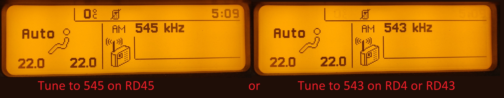
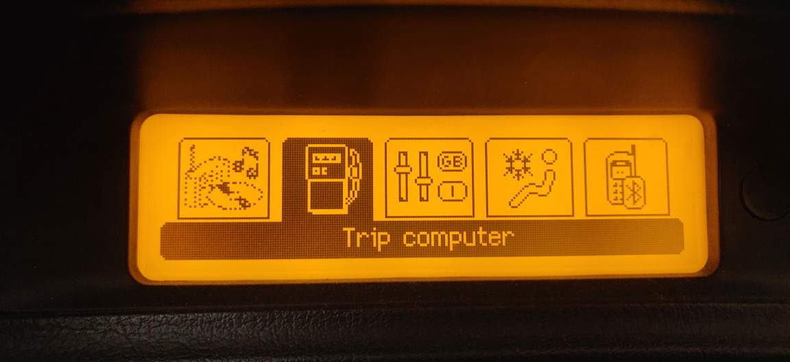
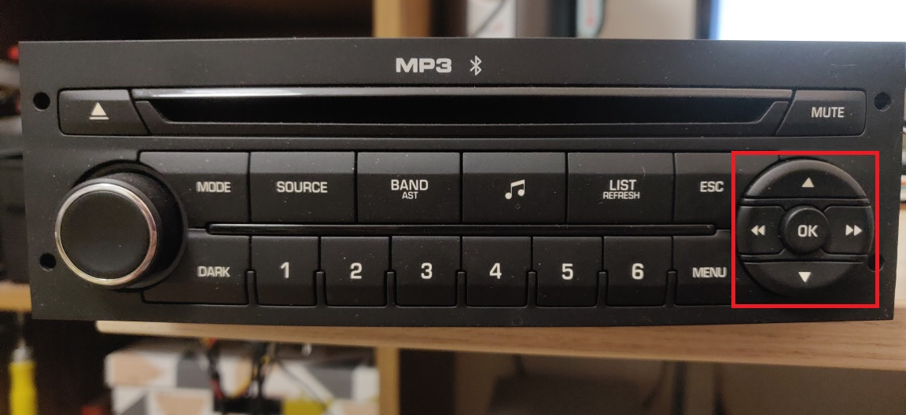

# PSA VAN-CAN protocol bridge

### What is it ?

In the beginning of 2000's the PSA group (Peugeot and Citroen) used VAN bus as a communication protocol between the various comfort-related equipment. Later around 2005 they started to replace this protocol in their newer cars with the CAN bus protocol, however some cars had VAN bus inside them until 2009.

The goal of this project is to have the new peripherals (mainly the head unit and the multi function display) using the CAN bus protocol working inside cars utilizing VAN bus.

### Why ?

Because it is fun. But other than that I wanted to replace the head unit of my car with another one which supports playing MP3 and also supports the original remote stalk behind the steering wheel. I also wanted to have the new shiny display working in my car from newer models. If you are interested, you can read the whole story behind the development at the [History section in the wiki](wiki/history.md).

### Components

The components needed for the project to work in your car is the following:
- Head unit (RD4/RD43/RD45)
- Multifunction display
- ISO-Quadlock-Display-JST XH6 conversion cable ([see more info in the wiki](wiki/pinouts-and-patch-lead.md))
- ISO-fakra aerial antenna converter
- PSA VAN-CAN protocol bridge hardware

I built a "shield" for the ESP32 dev board where I integrated the CAN bus transceivers and the TSS463C VAN controller onto one board. The KiCad project files can be found in [this repository][psavancanbridgehw].


### Liability

I used the software in my car for months, without any sign of errors. However I cannot take any responsibility if something goes wrong if you build it and install it in your car. So use the software and hardware at your own risk.

### Warning

⚠️ There is an open issue with certain cars where the board causes the BSI to crash. Please read the issue here for the details and a workaround: [#34](https://github.com/morcibacsi/PSAVanCanBridge/issues/34)

### Functionality

I implemented the functions which came with the original V2C boards (see what are those in the [history section in the wiki](wiki/history.md)), and even more! I created a video which demonstrates most of the functionality:

[](https://www.youtube.com/watch?v=Qk_8EhsqwUA "Watch it on YouTube")

But here is the list of the bridged functions:

 - Head unit support: RD4/RD43/RD45
 - Radio remote stalk support
 - VIN bridging for the anti-theft functionality of the RD4/RD43/RD45 head units
 - Speed and RPM (for automatic volume correction functionality in the head unit)
 - Messages shown on the multifunction display (MFD)
 - Air conditioning status (speed, air recycling, rear window demist, A/C enabled status also the internal temperature, and the directions are read via diagnostic messages)
 - Most of the odometer functionality (fuel level, coolant temperature, lights and turn-indicator status, mil, airbag lights, only the battery and the heating spark indicator is missing)
 - Display and radio lights based on the side lights and dipped beam status
 - Trip computer related data
 - Door statuses
 - Outside temperature
 - Economy mode warning
 - Seatbelt warning (if the vehicle speed is above 10km/h)
 - Display the remaining fuel in percentage
 - Display the remaining fuel in liters
 - Display the oil temperature
 - Semi-automatic VIN coding for the headunit to stop beeping (anti theft protection)

### Removing the old display from the car

If you remove the original display from the car the trip computer related data, the door statuses, and the digital air conditioning system may stop working. In the 307 the VAN data wires for the A/C are routed through the display. So obviously if you remove the display the circuit will be broken, which is pretty easy to fix. You just need to create two shortcuts on the original connector (4-5 DATA pins and 17-18 DATAB pins).


The reason behind the missing functionality is due to the fact that the display queries the BSI for the trip computer data, and the door statuses. If you would like to remove the original display from your car you need to build a hardware revision which contains a TSS463C.

### Head unit anti-theft protection

In cars made by PSA the the head unit contains the VIN number. The BSI sends it's VIN on the CAN bus. If the head unit detects a mismatch between the VIN coded inside it and the VIN received on the CAN bus then signals it with a beeping every few seconds. To prevent this you need to configure the VIN coded into your head unit in the config.h file. If you don't know the VIN inside your head unit then you can do it via the following semi-automatic method. You only need to do this once as the device stores the correct VIN number for the radio.

1. Turn on the radio (source should be tuner)
2. Switch to AM band and set it to 545 kHz (if you have an RD45) or 543 kHz (if you have an RD4 or RD43)

3. Press the Menu button on the radio (you should see this menu). It doesn't matter which item is selected.

4. Press the following combination with the arrows on your radio:
Left-Right-Left-Right (almost like the Konami code :smiley:)
If you mistype the combination, then exit the menu, and return to it again.

5. Now the beeping should stop

### Compatibility

The software was tested on a Peugeot 307 SW made in 2004 however most probably it is compatible with all of the cars with VAN bus made by the PSA group. Here is a short list about the cars which should be compatible:

- Peugeot 206 multiplexed (MUX) versions (2001.09 - )
- Peugeot 206+
- Peugeot 307 (2001-2005 first quarter)
- Peugeot 406 (2000-)
- Peugeot 1007 (2005-2007)
- Peugeot Partner
- Citroen C2
- Citroen C3 (2001-2005)
- Citroen C5 (2001-2005)
- Citroen C8 (2001-2005)
- Citroen Berlingo
- Citroen Xsara/Picasso
- EuroVan2 (Peugeot 807,Citroen C8, Fiat Ulysse, Lancia Phedra)

### Installation
The easiest place to install the hardware in a car is the connectors of the original head unit. Below you can see the schematics of a patch lead which converts the ISO connector to Quadlock type and exposes the VAN and CAN data pins to a JST XH 6 connector where you can connect the PSA VAN-CAN bridge hardware.

⚠️ On board rev. 1.5 (and also for newer) the DATA and the DATAB lines are swapped, so if you are upgrading your board, you need to swap these 2 lines.

#### Board rev. <= 1.4


#### Board rev. >= 1.5


### Setup

The device creates a WiFi access point when there is no configuration saved on the device or the following conditions are met: the front left door is open and the high beam is on and the emergency lights are blinking (the combination is to avoid accidentally turning on the access point). When the access point is on, the VAN bus reading is disabled to free up CPU cycles.

After connecting to the access point the setup page is available by opening the following address in a web browser: http://192.168.100.1/

After setting up the board, a reboot is needed (there is a button on the setup page), but disconnecting from the access point also causes the device to reboot.

### Building the project

#### From PlatformIO
The project is built using PlatformIO so you need to use that. You can set your board type in the platformio.ini file. The one called **esp32doit-devkit-v1** is board version 1.4 and **esp32_v15** is board version 1.5. Selecting one of these will load the corresponding BoardConfig_*.h file. These contain the board specific pin settings. The default is the 1.5 version with ULP VAN bus writing (so no TSS463C is needed).

```ini
#default_envs = esp32doit-devkit-v1
default_envs = esp32_v15
```

#### From Arduino
It might be possible to build the project using the Arduino IDE, but I don't recommend nor support it. The project requires a specific version of the ESP32 board package and also of the libraries. It is almost guaranteed that you have different versions than needed, and it is really difficult to troubleshoot the issues arising in Arduino so please use PlatformIO.

### Used libraries

- [Arduino abstract serial][lib_abstract_serial] (you don't need to install this one as the required files are included in the src/SerialPort folder)
- [ESP32 RMT peripheral VAN bus reader][lib_esp32_van_rx] (can be installed from the library manager from the Arduino IDE)
- [TSS463C VAN interface library][lib_tss463c_van] (can be installed from the library manager from the Arduino IDE)
- [Arduino Library for the ESP32 CAN Bus][lib_esp32_can]
- [Queue][lib_queue]


[lib_abstract_serial]: https://github.com/computergeek125/arduino-abstract-serial
[lib_tss463c_van]: https://github.com/morcibacsi/arduino_tss463_van
[lib_esp32_van_rx]: https://github.com/morcibacsi/esp32_rmt_van_rx
[lib_queue]: https://github.com/SMFSW/Queue
[psavancanbridgehw]: https://github.com/morcibacsi/PSAVanCanBridgeHW
[install_esp32]: https://randomnerdtutorials.com/installing-the-esp32-board-in-arduino-ide-windows-instructions
