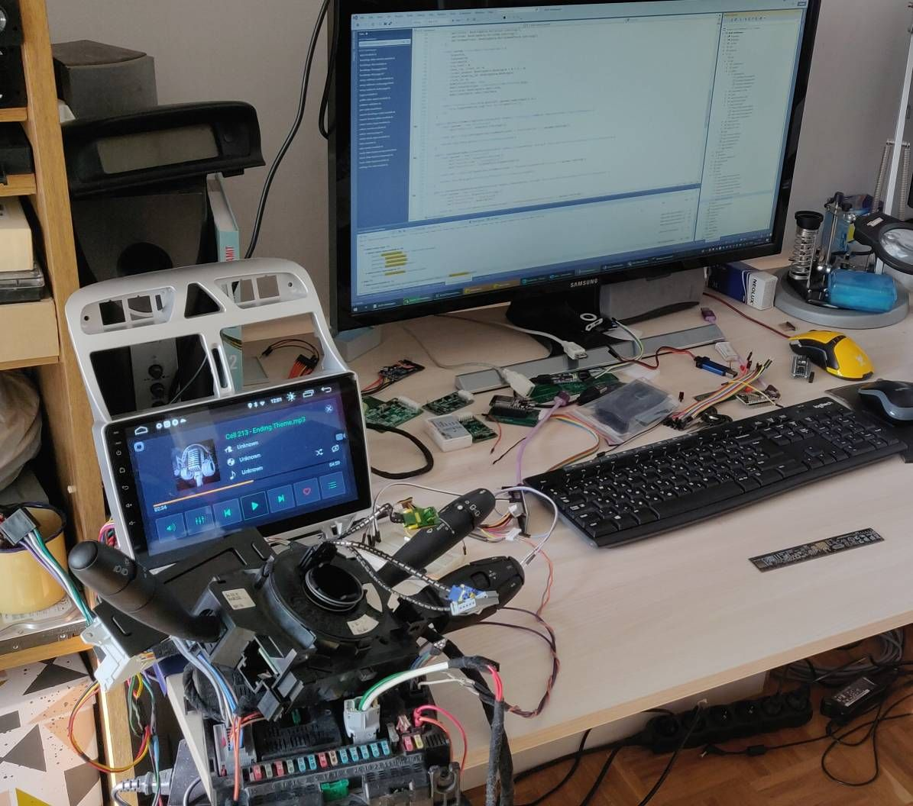
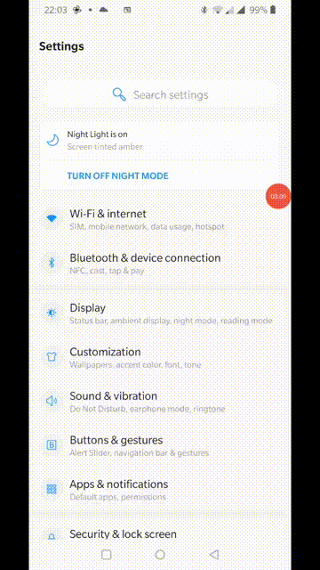
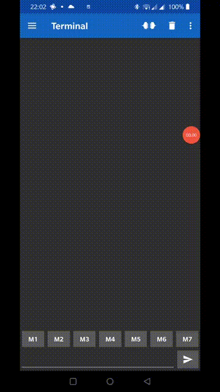

# Summary
Software development is hard and sometimes things aren't working as expected. It is even harder when you try to work on proprietary protocols where you can't really know how the system should work. This software was build by observing only one car (a 307 SW from 2004) with my usage habits. Other cars may have different setups and different usage. So there is a chance that I don't find a use-case and something doesn't work for you.

This article tries to summarize what options you have to debug the software. Unfortunately none of them is easy :(

## Debug options

### 1. Laptop + car
The simplest thing you can do is to connect the board to a laptop while you are in your car and put some Serial.print to the software and try to track with those what is going on. **However take note that while you are connected to your laptop don't connect the 12V from your car to the V2C board!**

### 2. BSI on desk
The second option is to have a spare BSI, a display, odometer, COM2000 and wire it together on a bench. For this you need to look up the wiring diagram of these units and connect it accordingly. With this setup you can work with real VAN bus data, however you can't really affect the messages. It would take a massive amount of work to have full control over the packets (you'd need to wire all the actuators, sensors) so this is kind of limited, however a few messages still can be tested.

### 3. VAN bus capture + software replay
The third option has proven to be useful several times when something only happens inside a real car or when a user reports a weird error which can't be reproduced on my car. This requires a VAN bus capture which can be created two ways:
1. via serial terminal (**make sure you don't connect the 12V to the board while it is connected to your laptop**).
2. Or if you have an Android device then you can connect to the V2C board via bluetooth and create a capture with this sofware: [https://play.google.com/store/apps/details?id=de.kai_morich.serial_bluetooth_terminal&hl=en](https://play.google.com/store/apps/details?id=de.kai_morich.serial_bluetooth_terminal&hl=en) I am sure that alternatives exists for iPhones as well.

Such captures can be "replayed" with the help of a small application (currently unreleased) which sends the captured packets through the serial port to the V2C board. The board processes them as they would come through the VAN bus. In most cases this helps but unfortunately this is just an emulation, so it isn't exactly the same as you would be in the car. But this is the most flexible as you can narrow down the problem to several messages which can be replayed as many times you want.
When a user reports a problem I usually ask for a capture and a short video with the problem. With these two things there is a good chance to fix the problem.