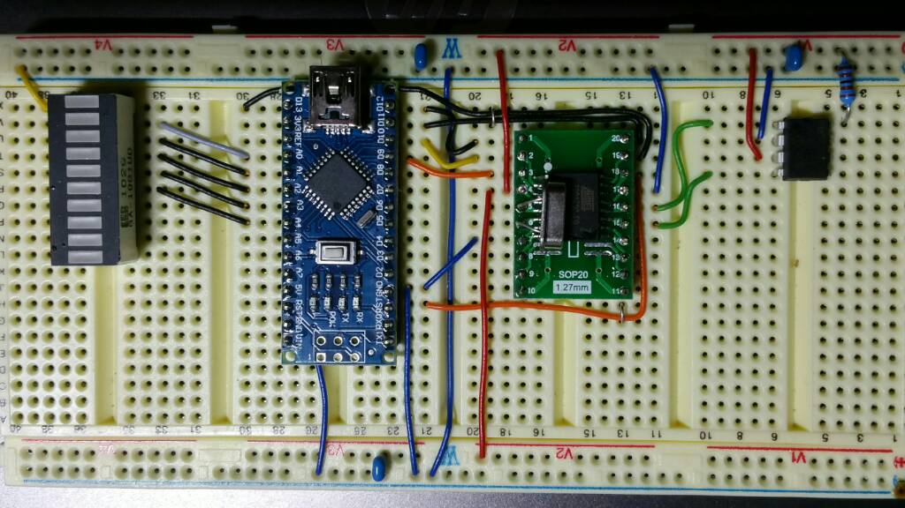

It was 2013 or maybe 2014 when I first found a [french forum](http://www.forum-auto.com/les-clubs/peugeot-206-207/sujet174953.htm) where some guys were discussing about reverse engineering VAN bus communication. They tried to replicate the functionality of the CD changer with a PIC based hardware. They gathered a lot of information about the protocol and identified most of the frames which they published on the [rt3wiki forum](http://rt3wiki.free.fr) which was already down when I found it's address.

By that time I did not have much knowledge about electronics, C nor assembly programming so replicating their work was impossible for me. This was due to the lack of knowledge from my side and also there were no clear instructions on the internet on building the hardware interface not to mention the software part. I dug out some .hex files and I also found some [assembly source code](https://github.com/dwery/van-bus) which I could not manage to find out how to use. However I had some ideas of a new multifunction display which would replace the old display in my 307.

The lack of knowledge made me abandon this idea of mine, but time by time I attacked the internet with VAN bus related queries and in 2015 I got lucky when I found this youtube video:

George was using an Arduino to interface with his Peugeot 206. I wrote a message to him and he was kind enough to send me a prototype board and a sketch to monitor the VAN bus. I started to dig myself through the [datasheet of the TSS463C](http://ww1.microchip.com/downloads/en/DeviceDoc/doc7601.pdf) VAN Controller IC and based on that information and George's code I came up with a library to read/write the bus. Fortunately Arduino is pretty easy to start learning embedded development.

In the meanwhile I found another [nice blogpost](http://jouston.blogspot.com/2015/02/rd45-upgrade-from-rd3.html) where a guy (Jouston) wrote an article about a VAN-CAN protocol converter board (V2C) which was invented/manufactured by some chinese guys. I bought one (actually two, a working fake one and an original) from aliexpress and used it for years in my Peugeot 307. Unfortunately it was incomplete in terms of functionality as converting the error messages to the new display were not implemented in those boards. As I was chatting with Jouston about the future of the V2C board I realized that they stopped the development of the product. So I decided that I'll roll my own version of the product with the missing functionality and maybe even more. So I spent more time on finding useful bits and pieces of information regarding the CAN bus protocol of newer Peugeot/Citroen cars. I found a [russian forum](http://www.c4-sedan.ru/forum/viewtopic.php?f=10&t=2545) with very extensive information on the CAN bus of Citroens

So there was nothing else left to create the hardware part. Unfortunately this meant for me that I had to learn how to design PCB boards. I was lucky again as I found a [page](http://web.archive.org/web/20180225084958/http://www.openhardwarehub.com/projects/40-Arduino-CAN-BUS-OBD-Gas-Gauge#!prettyPhoto) which ceased to exists in the meantime where a helpful mate created a board for interfacing CAN bus. I took the chance and used his files as a base to create my own board integrating both the VAN and CAN parts.

And after a christmas holiday I came up with a (more or less) working version of a protocol bridge which translates VAN bus packets to CAN bus packets!

Of course this was not that easy because I did not know any way to check what is going on the wires. But I realized that there are logic analyzers which were created to do this kind of sniffing. So I bought an Saleae Logic analyzer clone. I hooked up everything and I had to realize that if there is no visualizer for a protocol it is kind of painful to decode it. So another side project was to create an [analyzer for Saleae](https://github.com/morcibacsi/VanAnalyzer) to decode VAN bus packets. It was a huge help to me that I found [Graham Auld's page](http://graham.auld.me.uk/projects/vanbus/lineprotocol.html) where he wrote an excellent article on the protocol.

But back to my protocol bridge: I had to realize that for this kind of job the Arduino Pro Mini I used is not powerful enough. Or maybe it is but as I said I did not have enough experience in embedded development and I could not make it fast enough. But I found a guy on facebook who wanted to interface the VAN bus and he wanted to use an ESP32 board.

So there we are... I started to study that board. I found out that this board includes a CAN controller so I don't have to develop as complicated PCB board as before. As I was thinking I remembered that the 'official V2C boards' and also the early boards from the french forum were using CAN transceivers to interface the VAN bus. As I was fiddling around with the ESP32 I found out that maybe I could use the RMT peripheral of the ESP32 to interface the bus. And I discovered that reading the VAN bus with the RMT peripheral is not that complicated, so I implemented the VAN bus reading utilizing the RMT peripheral of the ESP32. This was a huge breaktrough as after many years of struggling and fiddling around with the TSS463C, I actually had a working implementation. So this gave a boost to the whole project, an early prototype board was created, and finally I could actually focus on the business logic of the application.

Things finally started to work. I discovered new information in the packets, and with some trial and error finally I understood how the various message types are working on the bus. Actually the information was there inside the datasheet of the TSS463, but finally it started to make sense for me. I found out that removing the original display from the car will remove some messages as the display is the initiator for the trip computer and the door statuses. So the project got a new direction, to [include the TSS463C also on my ESP32 shield](https://github.com/morcibacsi/PSAVanCanBridgeHW/tree/v1.4). However as it is a 3.3v device and the Atmel TSS463C IC I used is operating at 5v I need to include a level converter in the board. Fortunately there was some guy who built a circuit with a [TSS463C and a CAN transceiver](https://www.peugeotboard.de/threads/56330-508-mods-by-profor?p=409494&viewfull=1#post409494) so I could be sure that replacing the REMQ 0339 (Alcatel 2840) IC which was pretty hard to find with an easily available MCP2551 will work. I was happy for this finding as the MCP2551 does not require as much electronic parts as the other one. When I finally got a working board (the first version had several flaws) I implemented the code for reading the trip computer data. With the new board I could experiment more easily with the various messages. With the help of a PP2000 diagnostic software and by writing a simple monitoring tool I discovered some diagnostic packages, and I could include the internal temperature, and the airflow directions from the A/C ECU.

# Project costs

The whole project took me almost 4 years. As I mentioned there were times when I haven't worked on it for months due to the failures and issues I have faced. But if I would have to guess the net time which I actually spent on it, I believe it would be more than 1000 hours.

I tried to collect all the costs of the projects and it is around 1200 USD (in comparison my car from 2002 worths around 2000 USD). So if I'd consider all the efforts I have made to have this project done I could say that from that money (if I count the hours with my salary as payed working hours) I could have bought a new car :) However I learned a lot and I could say that it totally worth it.

PCB manufacturing
  * 1st prototype: 23.12 USD (10 pcs) (7.130 HUF)
  * 2nd prototype: 25 USD (20 pcs) (6.900 HUF)
  * 3rd prototype: 15.76 USD (20 pcs) (4.559 HUF)
  * 4th prototype: 32.23 USD (20 pcs) (9.694 HUF)
  * 5th prototype: 32.23 USD (20 pcs) (9.651 HUF)

  * CAN BSI: 16.000 HUF (~52 USD)
  * CAN odometer: 15.000 HUF (~50 USD)
  * VAN odometer1: 8.500 HUF (~28 USD)
  * VAN odometer2: 4.000 HUF (~13 USD)
  * V2C (orig): 37.534 HUF (~125 USD)
  * V2C+RD43 (copy): 40.532 HUF (~130 USD)
  * MFD 8.446 HUF (~28 USD)
  * MFD 8.190 HUF (~26 USD)
  * MFD 8.034 HUF (~25 USD)
  * MFD 5.000 HUF (~16 USD)
  * RD4: 7.200 HUF (~23 USD)
  * RD45: 22.431 HUF (~72 USD)
  * RT3: 35.000 HUF (~115 USD)
  * Climate control+cables: 5.000 HUF (~16 USD)
  * ISO-quadlock: 4.162 HUF (~13 USD)
  * Arduino modules: 2.160 HUF + 3.646 HUF + 2.603 HUF + 15.792 HUF (~78 USD)
  * Circuit components: 3.163 HUF + 1.150 HUF + 550 HUF + 5.160 HUF + 300 HUF + 2.592 HUF + 5.506 HUF + 2.059 HUF + 1.024 HUF + 5.149 HUF + 4.163 HUF + 3.812 HUF + 11.079 HUF + 4.723 HUF + 1.446 HUF + 2.478 HUF (~177 USD)
  * ESP32: 6.613 HUF + 2.043 HUF + 2.885 HUF + 993 HUF + 3.163 HUF (~52 USD)

Total: 357.215 HUF (~1200 USD or ~ 1000 EUR in 2019)
