 # Connector pinouts and patch lead

 This document provides the connector pinouts for various components you might want to retrofit into your car.

I also provide the schematics and photos for some of the patch leads which are needed to connect the components together. Although you might need a different one depending on what you are trying to connect. I can't create schematics for every possible combination, but based on the pinouts you can create your own patch lead if needed.

The basic principle is the following. The V2C Bridge needs +12V, GND, Data input (pin 1, 2 on the JST XH 6 type connector) and CAN output (pin 3, 4 on the JST XH 6 type connector). The data input can be either VAN or CAN, depending on what car you have.

Data input comes from the car and CAN output goes to whatever component you want to retrofit to the car. V2C Bridge is a man-in-the-middle device which converts the incoming data for the retrofitted components.

The 12V from either VAN+ or CAN+ power source. These are power sources which are automatically switched on when you open the car, and automatically switched off when you close it, or after a while when you turn off the ignition.

⚠️ You should not use the permanent 12V source, because it will drain your car battery!

## AEE2001 -> AEE2004 patch lead schematics

This one is specifically for the RD4, RD43, RD45 or RT6 head units, but if you were to replace the quadlock connector with the one for the NAC or IVI, you can use the same schematics for those as well. The only difference is the connector and the pinout of that connector. You could also add a connector for the matrix display or HUD display if you want to retrofit those as well.

In order to build the patch lead for AEE2001 -> AEE2004 you are going to need the following parts.

* ISO female connector
* Quadlock connector
* Peugeot screen connector (12 pin)
* JST XH 6 type connector
* Some wires

⚠️ On board rev. 1.5 (and also for newer) the DATA and the DATAB lines are swapped, so if you are upgrading your board, you need to swap these 2 lines.

### Board rev. <= 1.4

### Board rev. >= 1.5

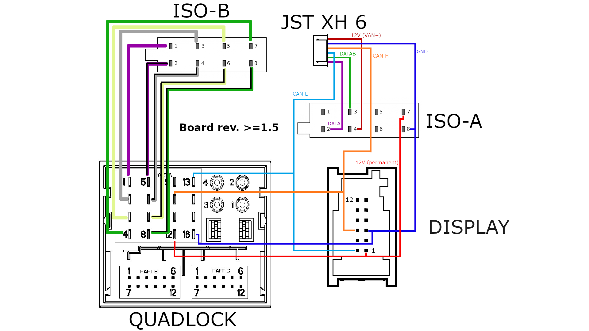

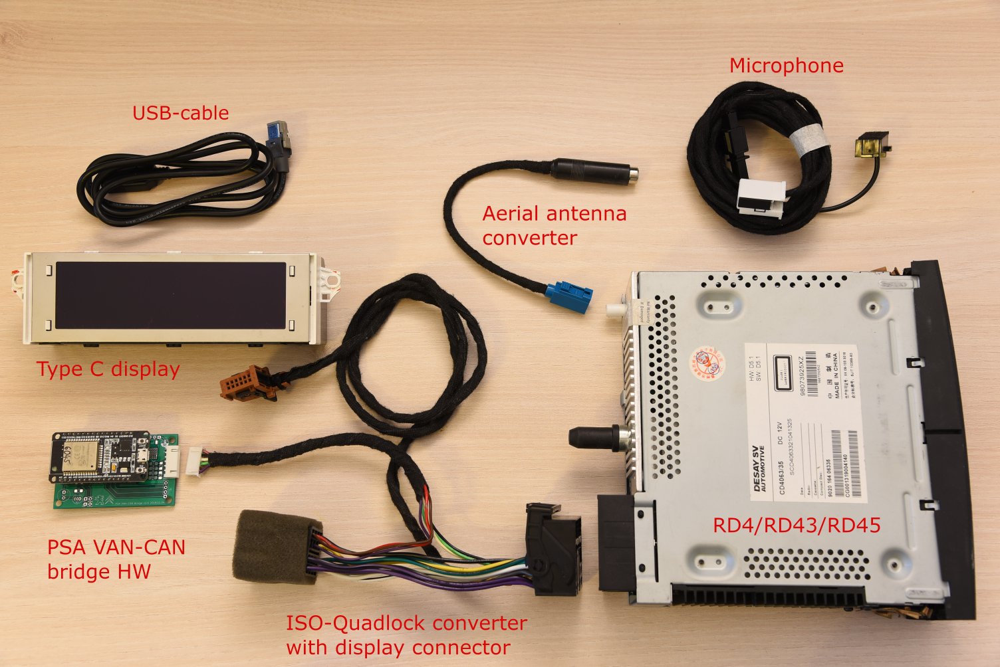

## AEE2004 -> AEE2010 patch lead schematics

Take note that I left out the quadlock socket (only the plug is there) as it has straight wires, except the CAN wires, which I drawn. For this I just bought a quadlock extension cable and removed the CAN wires.

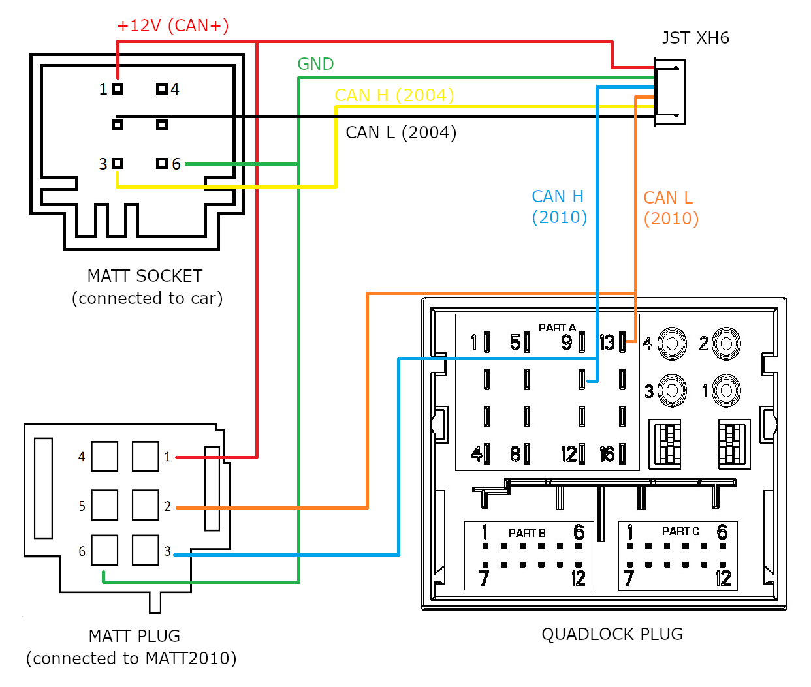

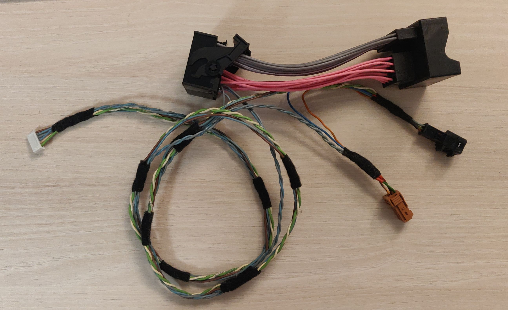

### MATT 2004 -> MATT 2010 patch lead schematics

Someone wanted to replace the matrix display in his car with a newer one, for such case this schema can be applied.

It shows the MATT plug you will connect to the new matrix display, and the JST XH6 plug for the V2C Bridge and the right side is where the wires are coming from the car.

The color of the wires wants to indicate the continuity of the wires, not the actual color of the wires in the car.

For the 12V and GND wires, they have been split so they provide power to the Bridge.
For the CAN wires coming from the car, they have been cut, and then it is reconnected by the V2C Bridge "internally" - signals go into the Bridge, and after conversion they go out to the new display.

Here are the wires you need to connect.

<table>
    <tr>
        <td>
            V2C Bridge pin
        </td>
        <td>
            Matrix connector on the car
        </td>
        <td>
            Matrix connector on the new display
        </td>
    </tr>
    <tr>
        <td>
            12V
        </td>
        <td>
            Pin 1
        </td>
        <td>
            Pin 1
        </td>
    </tr>
    <tr>
        <td>
            GND
        </td>
        <td>
            Pin 6
        </td>
        <td>
            Pin 6
        </td>
    </tr>
    <tr>
        <td>
            C2-H
        </td>
        <td>
            Pin 3
        </td>
        <td>
            -
        </td>
    </tr>
    <tr>
        <td>
            C2-L
        </td>
        <td>
            Pin 2
        </td>
        <td>
            -
        </td>
    </tr>
    <tr>
        <td>
            C1-H
        </td>
        <td>
            -
        </td>
        <td>
            Pin 3
        </td>
    </tr>
    <tr>
        <td>
            C1-L
        </td>
        <td>
            -
        </td>
        <td>
            Pin 2
        </td>
    </tr>
</table>

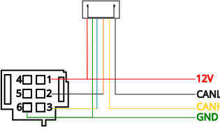

### Quadlock to NAC adapter

This is available from aliexpress, but you can also make your own based on the pinouts below.

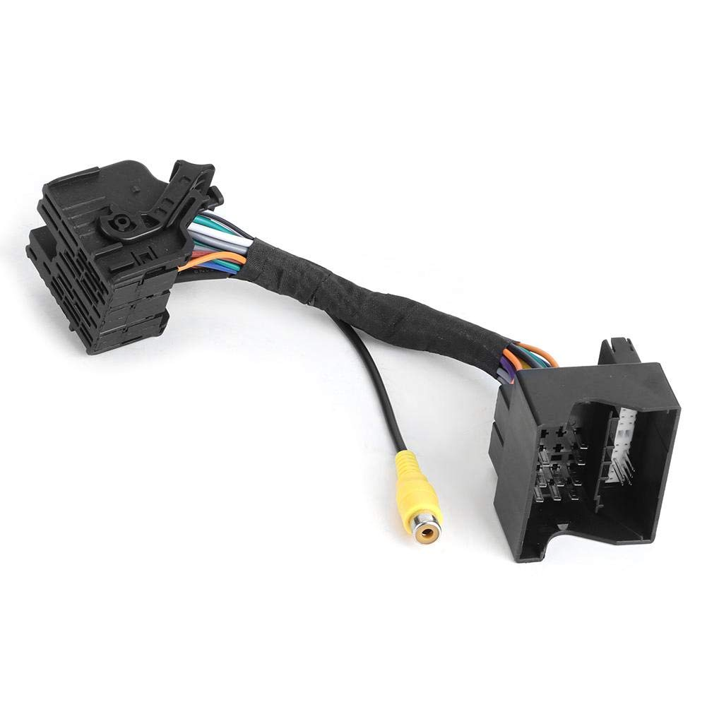

### Quadlock to IVI adapter

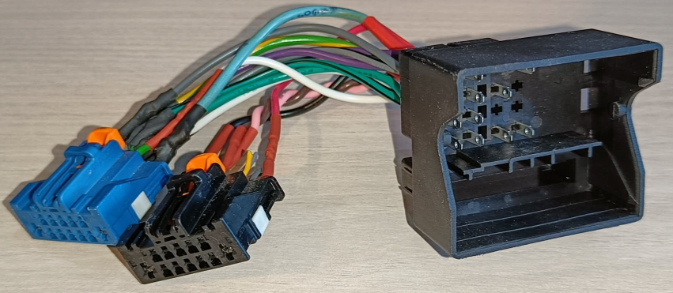

## ISO connector pinout

### ISO-A connector
<table>
    <tr>
        <td rowspan="5">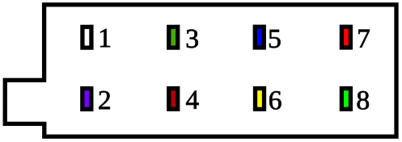</td>
    </tr>
    <tr>
        <td>1</td>
        <td></td>
        <td>2</td>
        <td>VAN Data bus (9004, DATA, VAN Low)</td>
    </tr>
    <tr>
        <td>3</td>
        <td>VAN Data bus B (9005, DATAB, VAN High)</td>
        <td>4</td>
        <td>+12V (VAN+)</td>
    </tr>
    <tr>
        <td>5</td>
        <td>Power for electric aerial (remote +12V for amplifier)</td>
        <td>6</td>
        <td>+12V (switched on ignition)</td>
    </tr>
    <tr>
        <td>7</td>
        <td>+12V (permanent)</td>
        <td>8</td>
        <td>GND</td>
    </tr>
</table>

### ISO-B connector
<table>
    <tr>
        <td rowspan="5">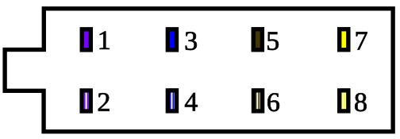</td>
        <td></td>
    </tr>
    <tr>
        <td>1</td>
        <td>+ Rear Right speaker</td>
        <td>2</td>
        <td>- Rear Right speaker</td>
    </tr>
    <tr>
        <td>3</td>
        <td>+ Front Right speaker</td>
        <td>4</td>
        <td>- Front Right speaker</td>
    </tr>
    <tr>
        <td>5</td>
        <td>+ Front Left speaker</td>
        <td>6</td>
        <td>- Front Left speaker</td>
    </tr>
    <tr>
        <td>7</td>
        <td>+ Rear Left speaker</td>
        <td>8</td>
        <td>- Rear Left speaker</td>
    </tr>
 </table>

## Display (EMF-A, EMF-C) connector pinout (12 pin)

<table>
  <tr>
    <td rowspan="7">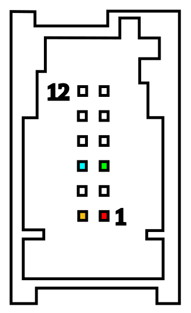</td>
    <td></td>
  </tr>
  <tr>
    <td>12</td>
    <td></td>
    <td>6</td>
    <td></td>
  </tr>
  <tr>
    <td>11</td>
    <td></td>
    <td>5</td>
    <td></td>
  </tr>
  <tr>
    <td>10</td>
    <td></td>
    <td>4</td>
    <td></td>
  </tr>
  <tr>
    <td>9</td>
    <td>CAN High (9024)</td>
    <td>3</td>
    <td>GND</td>
  </tr>
  <tr>
    <td>8</td>
    <td></td>
    <td>2</td>
    <td></td>
  </tr>
  <tr>
    <td>7</td>
    <td>CAN Low (9025)</td>
    <td>1</td>
    <td>+12V (permanent)</td>
  </tr>
</table>

## Display (EMF-C) connector pinout (6 pin)

<table>
  <tr>
    <td rowspan="4">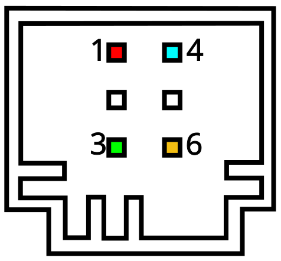</td>
    <td></td>
  </tr>
  <tr>
    <td>1</td>
    <td>+12V (CAN+)</td>
    <td>4</td>
    <td>CAN High (9024)</td>
  </tr>
  <tr>
    <td>2</td>
    <td></td>
    <td>5</td>
    <td></td>
  </tr>
  <tr>
    <td>3</td>
    <td>GND</td>
    <td>6</td>
    <td>CAN Low (9025)</td>
  </tr>
</table>

## Matrix display (MATT) connector pinout (6 pin)

<table>
  <tr>
    <td rowspan="4">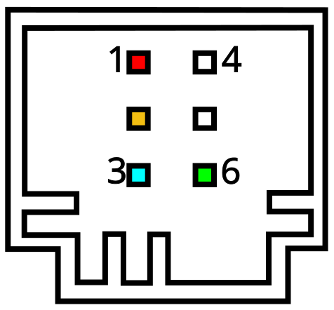</td>
    <td></td>
  </tr>
  <tr>
    <td>1</td>
    <td>+12V (CAN+)</td>
    <td>4</td>
    <td></td>
  </tr>
  <tr>
    <td>2</td>
    <td>CAN Low (9035)</td>
    <td>5</td>
    <td></td>
  </tr>
  <tr>
    <td>3</td>
    <td>CAN High (9034)</td>
    <td>6</td>
    <td>GND</td>
  </tr>
</table>

## HUD display (VTH) connector pinout

<table>
  <tr>
    <td rowspan="7">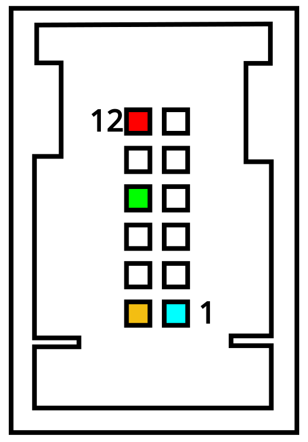</td>
    <td></td>
  </tr>
  <tr>
    <td>12</td>
    <td>12V (CAN+)</td>
    <td>6</td>
    <td></td>
  </tr>
  <tr>
    <td>11</td>
    <td></td>
    <td>5</td>
    <td></td>
  </tr>
  <tr>
    <td>10</td>
    <td>GND</td>
    <td>4</td>
    <td></td>
  </tr>
  <tr>
    <td>9</td>
    <td></td>
    <td>3</td>
    <td></td>
  </tr>
  <tr>
    <td>8</td>
    <td></td>
    <td>2</td>
    <td></td>
  </tr>
  <tr>
    <td>7</td>
    <td>CAN Low (9035)</td>
    <td>1</td>
    <td>CAN High (9034)</td>
  </tr>
</table>

## Quadlock connector pinout

<table>
    <tr>
        <td rowspan="5">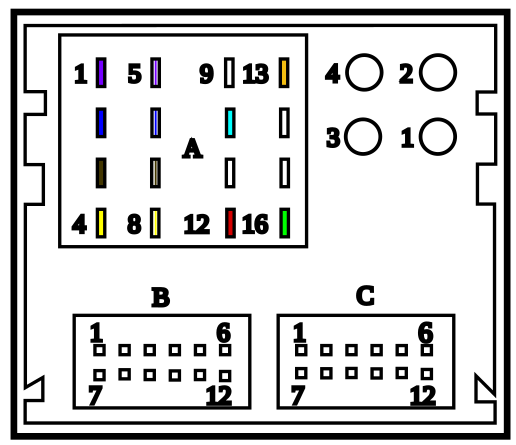</td>
    </tr>
    <tr>
        <td>A1</td>
        <td>+ Rear Right speaker</td>
        <td>A5</td>
        <td>- Rear Right speaker</td>
        <td></td>
        <td>A9</td>
        <td></td>
        <td>A13</td>
        <td>CAN Low (9025)</td>
    </tr>
    <tr>
        <td>A2</td>
        <td>+ Front Right speaker</td>
        <td>A6</td>
        <td>- Front Right speaker</td>
        <td></td>
        <td>A10</td>
        <td>CAN High (9024)</td>
        <td>A14</td>
        <td></td>
    </tr>
    <tr>
        <td>A3</td>
        <td>+ Front Left speaker</td>
        <td>A7</td>
        <td>- Front Left speaker</td>
        <td></td>
        <td>A11</td>
        <td>Power for electric aerial (remote +12V for amplifier)</td>
        <td>A15</td>
        <td></td>
    </tr>
    <tr>
        <td>A4</td>
        <td>+ Rear Left speaker</td>
        <td>A8</td>
        <td>- Rear Left speaker</td>
        <td></td>
        <td>A12</td>
        <td>+12V (permanent)</td>
        <td>A16</td>
        <td>GND</td>
    </tr>
</table>

## NAC connector pinout

<table>
    <tr>
        <td rowspan="10">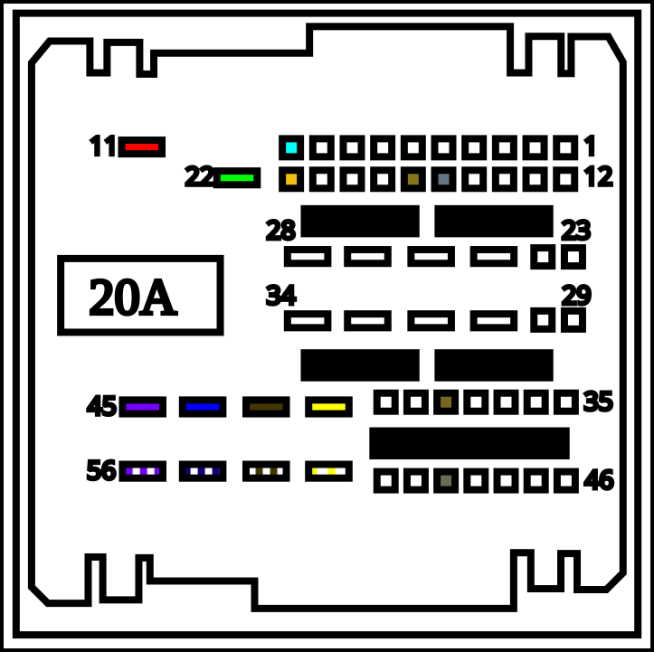</td>
        <td></td>
        <td></td>
        <td></td>
    </tr>
    <tr>
        <td>11</td>
        <td>+12V (permanent)</td>
        <td>22</td>
        <td>GND</td>
    </tr>
    <tr>
        <td>10</td>
        <td>CAN High (9024)</td>
        <td>21</td>
        <td>CAN Low (9025)</td>
    </tr>
    <tr>
        <td>16</td>
        <td>Video 1 IN-</td>
        <td>17</td>
        <td>Video 1 IN+</td>
    </tr>
    <tr>
        <td></td>
        <td></td>
        <td></td>
        <td></td>
    </tr>
    <tr>
        <td>39</td>
        <td>Microphone 2+</td>
        <td>50</td>
        <td>Microphone 2-</td>
    </tr>
    <tr>
        <td>42</td>
        <td>+ Rear Left speaker</td>
        <td>53</td>
        <td>- Rear Left speaker</td>
    </tr>
    <tr>
        <td>43</td>
        <td>+ Front Left speaker</td>
        <td>54</td>
        <td>- Front Left speaker</td>
    </tr>
    <tr>
        <td>44</td>
        <td>+ Front Right speaker</td>
        <td>55</td>
        <td>- Front Right speaker</td>
    </tr>
    <tr>
        <td>45</td>
        <td>+ Rear Right speaker</td>
        <td>56</td>
        <td>- Rear Right speaker</td>
    <tr>
</table>

## IVI pinout (A.H.W version)

### IVI black connector
<table>
    <tr>
        <td rowspan="7">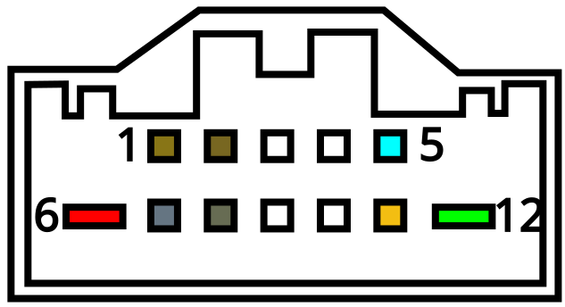</td>
        <td></td>
    </tr>
    <tr>
        <td>1</td>
        <td>Microphone +</td>
        <td>7</td>
        <td>Microphone -</td>
    </tr>
    <tr>
        <td>2</td>
        <td>Microphone 2+</td>
        <td>8</td>
        <td>Microphone 2-</td>
    </tr>
    <tr>
        <td>3</td>
        <td></td>
        <td>9</td>
        <td></td>
    </tr>
    <tr>
        <td>4</td>
        <td></td>
        <td>10</td>
        <td></td>
    </tr>
    <tr>
        <td>5</td>
        <td>CAN High (9034)</td>
        <td>11</td>
        <td>CAN Low (9035)</td>
    </tr>
    <tr>
        <td>6</td>
        <td>12V (permanent)</td>
        <td>12</td>
        <td>GND</td>
    </tr>
</table>

### IVI blue connector
<table>
    <tr>
        <td rowspan="7">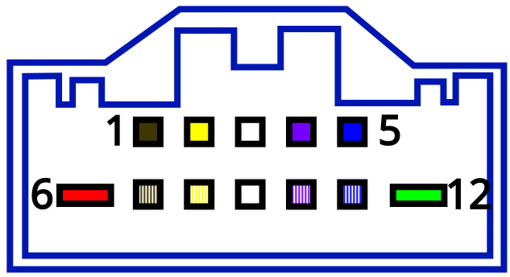</td>
        <td></td>
    </tr>
    <tr>
        <td>1</td>
        <td>+ Front Left speaker</td>
        <td>7</td>
        <td>- Front Left speaker</td>
    </tr>
    <tr>
        <td>2</td>
        <td>+ Rear Left speaker</td>
        <td>8</td>
        <td>- Rear Left speaker</td>
    </tr>
    <tr>
        <td>3</td>
        <td></td>
        <td>9</td>
        <td></td>
    </tr>
    <tr>
        <td>4</td>
        <td>+ Rear Right speaker</td>
        <td>10</td>
        <td>- Rear Right speaker</td>
    </tr>
    <tr>
        <td>5</td>
        <td>+ Front Right speaker</td>
        <td>11</td>
        <td>- Front Right speaker</td>
    </tr>
    <tr>
        <td>6</td>
        <td>12V (permanent)</td>
        <td>12</td>
        <td>GND</td>
    </tr>
</table>

----

## JST XH6 connector pinout

⚠️ On board rev. 1.5 (and also for newer) the DATA and the DATAB lines are swapped, so if you are upgrading your board, you need to swap these 2 pins.

<table>
    <tr>
        <td colspan="3">Board rev. <= 1.4</td>
    </tr>
    <tr>
        <td rowspan="9">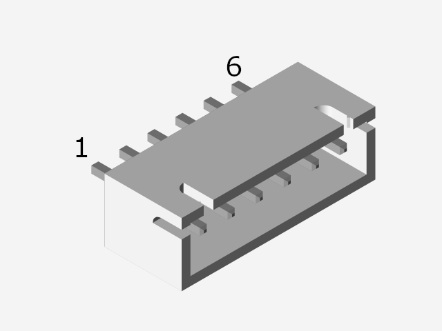</td>
    </tr>
    <tr>
        <td>1</td>
        <td>VAN DATAB, 9005, VAN High</td>
    </tr>
    <tr>
        <td>2</td>
        <td>VAN DATA, 9004, VAN Low</td>
    </tr>
    <tr>
        <td>3</td>
        <td>CAN Low</td>
    </tr>
    <tr>
        <td>4</td>
        <td>CAN High</td>
    </tr>
    <tr>
        <td>5</td>
        <td>GND</td>
    </tr>
    <tr>
        <td>6</td>
        <td>+12V</td>
    </tr>
</table>

<table>
    <tr>
        <td colspan="3">Board rev. >= 1.5</td>
    </tr>
    <tr>
        <td rowspan="9"></td>
    </tr>
    <tr>
        <td>1</td>
        <td>VAN DATA, 9004, VAN Low</td>
    </tr>
    <tr>
        <td>2</td>
        <td>VAN DATAB, 9005, VAN High</td>
    </tr>
    <tr>
        <td>3</td>
        <td>CAN Low</td>
    </tr>
    <tr>
        <td>4</td>
        <td>CAN High</td>
    </tr>
    <tr>
        <td>5</td>
        <td>GND</td>
    </tr>
    <tr>
        <td>6</td>
        <td>+12V</td>
    </tr>
</table>
