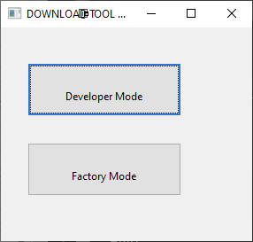
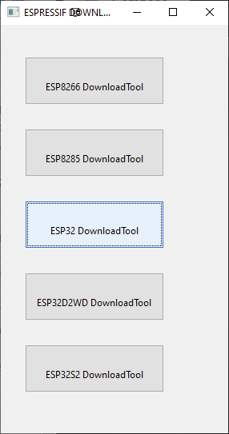
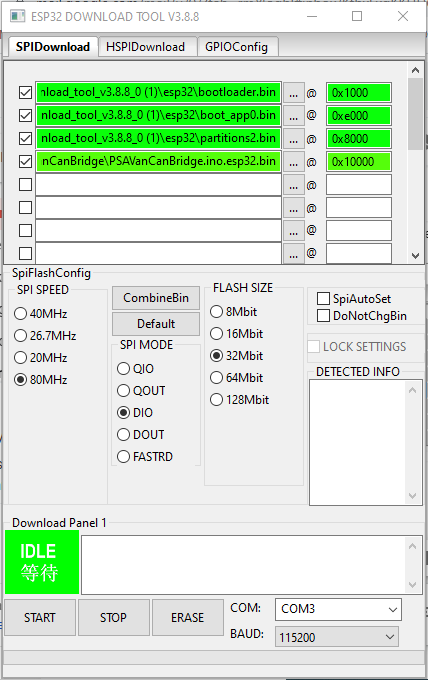
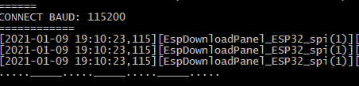

In the releases section there are binaries which can be installed with the Flash download tool from Espressif. Follow these steps to install them:

1. Download the Flash Download Tools (ESP8266 & ESP32 & ESP32-S2) from here: [https://www.espressif.com/en/support/download/other-tools](https://www.espressif.com/en/support/download/other-tools)
2. Extract, and run flash_download_tool_3.8.5.exe
3. Select developer mode:

4. Select ESP32 DownloadTool

5. Connect you ESP32 to the computer using an USB cable

6. Extract the archive you downloaded from the releases section

7. Browse the extracted firmware file, tick the checkbox, and set the address to: 0x10000
Set the application like shown below. (don't forget to select the COM port as well)
    When you try to upload to an ESP32 which was never programmed from Arduino then you need to upload these files as well:
    * [boot_app0.bin](../bin/boot_app0.bin)
    * [bootloader.bin](../bin/bootloader.bin)
    * [partitions2.bin](../bin/partitions2.bin)

    Otherwise it is enough to just upload the firmware @0x10000

8. Press Start button

When you see the following in the command line, you should press (and hold) the Boot button on your board for 2-3 seconds, until it starts writing the data.

