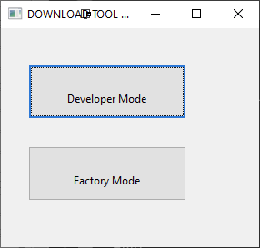
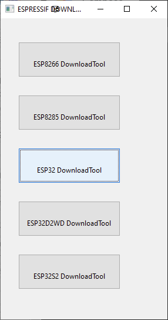
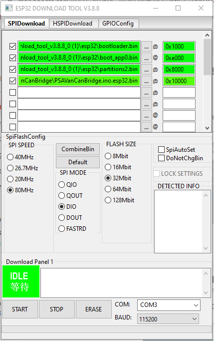
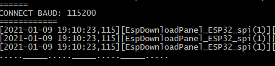

In the releases section there are binaries which can be installed with the Flash download tool from Espressif. Follow these steps to install them:

1. Download the Flash Download Tools (ESP8266 & ESP32 & ESP32-S2) from here: [https://www.espressif.com/en/support/download/other-tools](https://www.espressif.com/en/support/download/other-tools)
2. Extract, and run flash_download_tool_3.8.5.exe
3. Select developer mode:

4. Select ESP32 DownloadTool

5. Connect you ESP32 to the computer using an USB cable

6. Extract the archive you downloaded from the releases section

7. Open `FLASHING.txt` from the extracted archive. It lists the exact files and
addresses for that hardware target. Select all four supplied binaries in the
download tool using those addresses. In particular, the bootloader address is
`0x1000` on the ESP32 v1.3/v1.5 targets and `0x0` on the ESP32-C3/C6 targets.
The remaining addresses are `0x8000` for `partitions.bin`, `0xe000` for
`ota_data_initial.bin`, and `0x10000` for `firmware.bin`.

For an OTA update of a device that is already running compatible firmware, upload
only `firmware.bin` from the device setup page.

8. Press Start button

When you see the following in the command line, you should press (and hold) the Boot button on your board for 2-3 seconds, until it starts writing the data.

